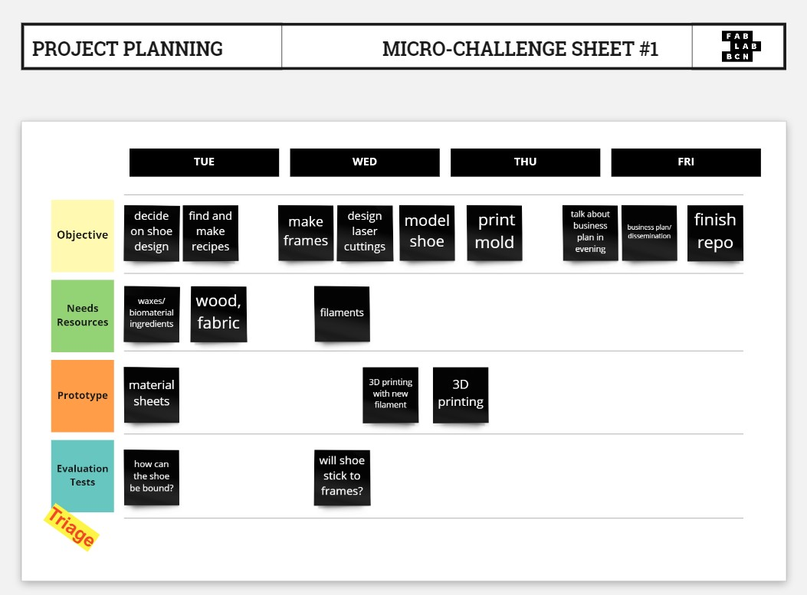
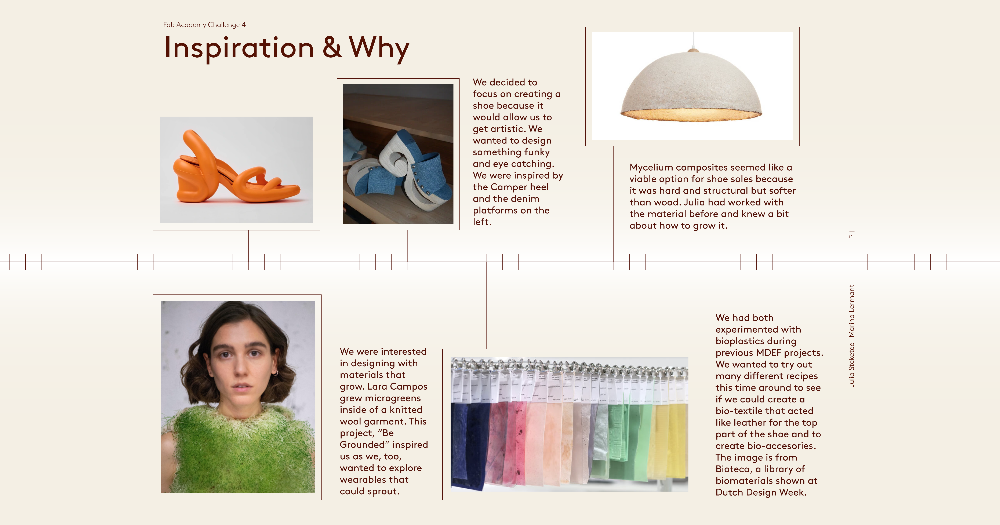
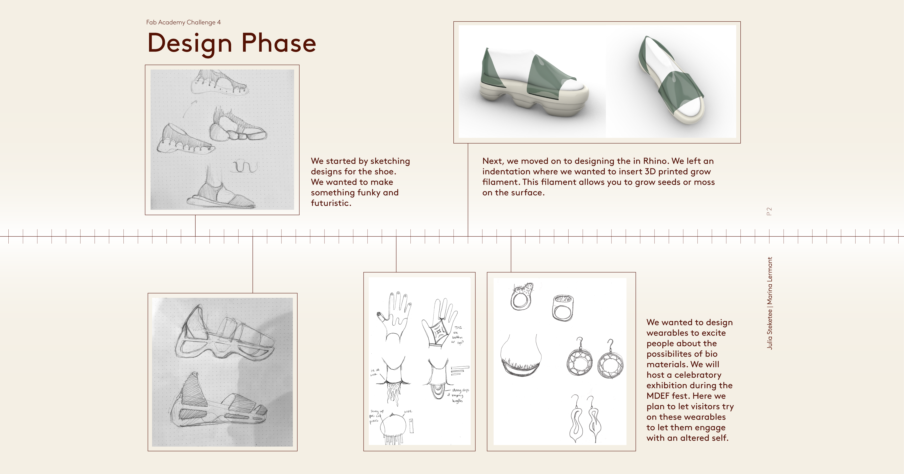
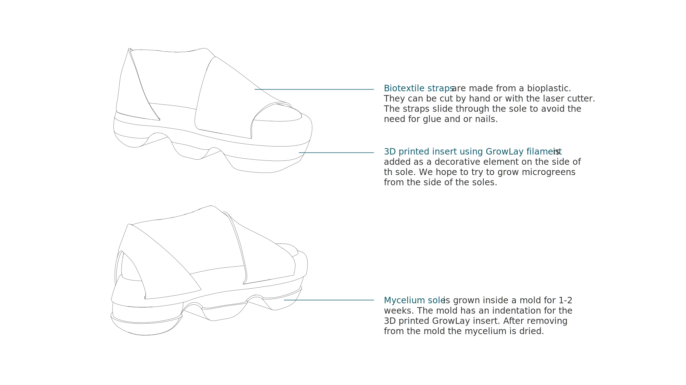
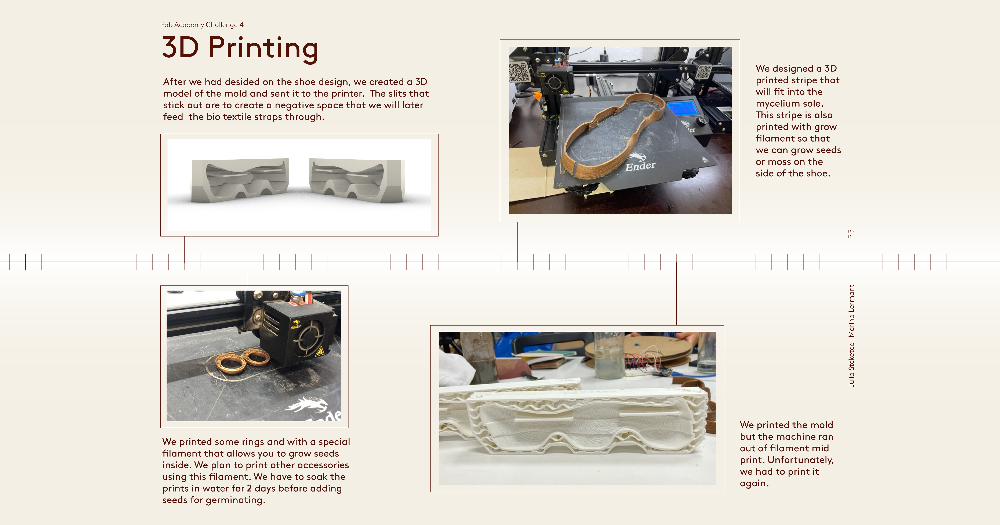

# fabmicrochallenge4
## “Integrated prototype” that helps your MDEF Project /Fest and integrates a range of units covered.

## Dissemination
### Myke Board
#### Materials
The Myke Board is a mycelium-based surfboard that seeks to replace the harmful materials in modern surfboards (polyurethane and expanded polystyrene) with more sustainable materials that are not harmful to the environment or to the shaper. The base substrate is made up of agricultural waste that is then joined together through a fungal strain known for its material properties. The result is a low-dense, hydrophobic material that can be shaped like a surfboard and has a similar performance. 

#### Audience
Surf schools, beginner surfers. People that are getting started in the sport are less picky about new materials that haven’t been thoroughly tested for performance.

#### Dissemination partners
The European Commission that supports innovation that tackles plastic pollution, environmentally mindful surf schools, design magazines and media.

#### Communication
The future of surfing is not in plastic, it’s in collaboration with the micro-organisms that surround us to create new tools to experience nature in a way that is beneficial to all stakeholders: users, micro-organisms, and the environment.

### Bioshoe & bio-wearables
#### Materials
The bio-shoe is a physical artifact which presents an alternative to material choices in traditional shoe production. The sole is shaped with mycelium which grows into a 3D-printed mold while the upper part consists of bioplastics. The shoe serves as an example of possibilities in a desired future which contains fewer non-renewable plastics and waste. Bio-wearables including jewelry, gloves, and accessories are made with bio-materials and grow-lay filament which are created to excite users during the event, help them engage more with an altered self while showing the possibilities of what can be made with biomaterials, and allow participants to have a playful, symbiotic relationship with material objects.

#### Bill of materials

#### Audience
The shoe and bio-wearables produced as part of this fourth micro-challenge will be displayed and present for use at a final showcase entitled Symbiatipico, located at Atipico restaurant and cultural event space. More than to generate a future business, the project aims to provoke conversation surrounding circular materials, question current production practices, and project ideas for a more sustainable future for items with short life spans. 

#### Dissemination partners

During the MDEF WTFuture(s) Fest, we will be organizing two events together. First, we will host a workshop at BIOMA (ConnectHort) where we will show participants how to make bioplastics and other bio-composites. We will invite members of the Fablab project, Remix El Barrio and hopefully attract a curious crowd that is keen to be part of the bio material revolution. After finishing the MDEF program, I am eager to keep working within the field of bio material research and build my material intelligence. I hope that this event will lead to future teaching and material research opportunities. If the workshop goes well, we could repeat it in the future. And perhaps this would be a nice entry point to more formally join the Remix el Barrio collective. Second, we plan to exhibit the shoe and wearables during a celebratory exhibition at Atípico, a restaurant and cultural space in La Pau, Barcelona. Visitors will be able to listen to live music and DJs, enjoy Spirulina cocktails, and adorn themselves with our bio-based wearables. The group show will present a variety of works from designed artifacts, audio visuals, and interactive machines, and living organisms. We plan to invite people interested in bio-design, technology and regenerative practices to the exhibit in order to converse about our work and potential future opportunities. We also plan to invite friends and contacts who are not in the field of design or sustainability. We hope that our shoe design and wearables will introduce this audience to new material alternatives and reimagine our relationships with other living organisms. See the posters to these two events below.

One on end, we want users and the general public to become intrigued and interested in the topics we present. By having them directly engage with tangible objects, it puts them in a space where what we are suggesting can become reality for an evening. We would assume that many young adults would be present, which we hope can bring these ideas into their daily lives. 

In tangent, we will be speaking with other designers, students in art/architecture/design, and professionals engaging with innovative projects. We would like to reach them through this event by having discussions with them, proposing ways to work collaboratively, and pushing ideas of interdisciplinary work. For these stakeholders, our goal would be to engage directly with them and continue the conversation, while potentially inspiring people to view the alternative presents as feasible and incorporate them into their design and research practices. 

