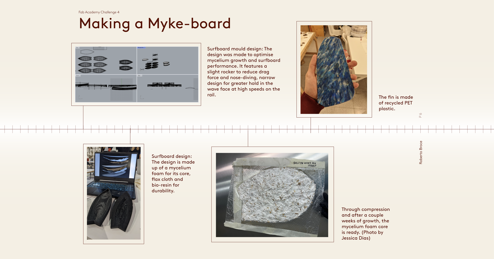

# fabmicrochallenge4
## “Integrated prototype” that helps your MDEF Project /Fest and integrates a range of units covered.

## Dissemination
### Myke Board
#### Materials
The Myke Board is a mycelium-based surfboard that seeks to replace the harmful materials in modern surfboards (polyurethane and expanded polystyrene) with more sustainable materials that are not harmful to the environment or to the shaper. The base substrate is made up of agricultural waste that is then joined together through a fungal strain known for its material properties. The result is a low-dense, hydrophobic material that can be shaped like a surfboard and has a similar performance. 

#### Audience
Surf schools, beginner surfers. People that are getting started in the sport are less picky about new materials that haven’t been thoroughly tested for performance.

#### Dissemination partners
The European Commission that supports innovation that tackles plastic pollution, environmentally mindful surf schools, design magazines and media.

#### Communication
The future of surfing is not in plastic, it’s in collaboration with the micro-organisms that surround us to create new tools to experience nature in a way that is beneficial to all stakeholders: users, micro-organisms, and the environment.

### Bioshoe & bio-wearables
#### Materials
The bio-shoe is a physical artifact which presents an alternative to material choices in traditional shoe production. The sole is shaped with mycelium which grows into a 3D-printed mold while the upper part consists of bioplastics. The shoe serves as an example of possibilities in a desired future which contains fewer non-renewable plastics and waste. Bio-wearables including jewelry, gloves, and accessories are made with bio-materials and grow-lay filament which are created to excite users during the event, help them engage more with an altered self while showing the possibilities of what can be made with biomaterials, and allow participants to have a playful, symbiotic relationship with material objects.

#### Audience
The shoe and bio-wearables produced as part of this fourth micro-challenge will be displayed and present for use at a final showcase entitled Symbiatipico, located at Atipico restaurant and cultural event space. More than to generate a future business, the project aims to provoke conversation surrounding circular materials, question current production practices, and project ideas for a more sustainable future for items with short life spans. 

#### Dissemination partners
One on end, we want users and the general public to become intrigued and interested in the topics we present. By having them directly engage with tangible objects, it puts them in a space where what we are suggesting can become reality for an evening. We would assume that many young adults would be present, which we hope can bring these ideas into their daily lives. 

In tangent, we will be speaking with other designers, students in art/architecture/design, and professionals engaging with innovative projects. We would like to reach them through this event by having discussions with them, proposing ways to work collaboratively, and pushing ideas of interdisciplinary work. For these stakeholders, our goal would be to engage directly with them and continue the conversation, while potentially inspiring people to view the alternative presents as feasible and incorporate them into their design and research practices. 

